<div align="center">


# ☕ Café Aroma

**Vitrine virtual de uma cafeteria artesanal — do grão à xícara.**

Projeto acadêmico desenvolvido para o curso **Técnico em Informática para Internet** do **CPET**, com foco em boas práticas de desenvolvimento web e mobile. A aplicação apresenta o cardápio, a história do café, um canal de contato e uma área administrativa simples.

[](https://cafe-aroma-backend.onrender.com/api)
[](https://cafe-aroma-ftdk.onrender.com/home)
[](https://cafe-aroma-backend.onrender.com/api/swagger-ui/index.html#/)

> ⚠️ **Atenção:** O Render coloca serviços gratuitos em hibernação após inatividade. Na primeira requisição, o backend pode levar **até 60 segundos** para acordar. O frontend exibe uma tela de espera automática e redireciona quando o serviço voltar.

</div>

---

### 📋 Índice

- [Sobre o projeto](#-sobre-o-projeto)
- [Funcionalidades](#-funcionalidades)
- [Tecnologias](#-tecnologias)
- [Arquitetura](#-arquitetura)
- [Backend](#-backend)
- [Frontend Web & Mobile](#-frontend-web--mobile)
- [Deploy — Render](#-deploy--render)
- [Como executar localmente](#-como-executar-localmente)
- [Autor](#-autor)

---

### 💡 Sobre o projeto

O **Café Aroma** é uma vitrine virtual desenvolvida como projeto de conclusão de curso técnico. O objetivo foi construir uma aplicação completa, do backend ao mobile, aplicando conceitos de arquitetura limpa, boas práticas de código e deploy em nuvem.

O backend é responsável por **todas as informações e imagens** da aplicação. As imagens são armazenadas no servidor e trafegam via **Base64**, eliminando a necessidade de um serviço externo de armazenamento de arquivos.

---

### ✨ Funcionalidades

| Área | Funcionalidade |
|---|---|
| 🏠 Home | Apresentação do café com hero, logo e seção "Nossa História" |
| ☕ Produtos | Cardápio por categorias com accordion — carrega produtos ao clicar |
| ✉️ Contato | Formulário com validação e feedback de envio |
| ❓ FAQ | Perguntas frequentes com accordion e scroll interno |
| 🛡️ Admin | Leitura de contatos recebidos e cadastro de novas FAQs |
| 📴 Offline | Tela de espera automática com retry quando o backend hiberna |

---

### 🛠 Tecnologias

### Backend
| Tecnologia | Versão |
|---|---|
| Java | 17 |
| Spring Boot | 3.5.13 |
| Maven | 4.0.0 |
| Spring Web | — |
| Spring Data JPA | — |
| Banco H2 (em memória) | — |
| Lombok | — |
| SpringDoc / Swagger | — |

### Frontend Web & Mobile
| Tecnologia | Versão |
|---|---|
| Node.js | 22.22.2 |
| npm | 10.9.7 |
| Angular CLI | 20.3.24 |
| Ionic CLI | 7.2.1 |
| Android (Mobile) | API 36 — Android 16 Baklava |

### Ferramentas de desenvolvimento
| Ferramenta | Uso |
|---|---|
| IntelliJ IDEA Ultimate | Desenvolvimento Backend |
| VS Code | Desenvolvimento Frontend |
| Android Studio | Build e teste mobile |
| Ubuntu | Sistema operacional de desenvolvimento |
| Render | Deploy backend e frontend web |

---

### 🏗 Arquitetura

A aplicação segue uma arquitetura cliente-servidor clássica, onde o backend centraliza toda a lógica de negócio e os dados, e o frontend consome via API REST.

```
┌───────────────────────────────────────────────────────┐
│                     FRONTEND                          │
│  ┌──────────────────┐      ┌──────────────────────┐   │
│  │   Web (Ionic +   │      │   Mobile (Android    │   │
│  │   Angular)       │      │   via Capacitor)     │   │
│  │  Render Static   │      │   .apk               │   │
│  └────────┬─────────┘      └──────────┬───────────┘   │
└───────────┼───────────────────────────┼───────────────┘
            │         HTTP REST         │
            ▼                           ▼
┌─────────────────────────────────────────────────────────┐
│               BACKEND — Spring Boot                     │
│         https://cafe-aroma-backend.onrender.com/api     │
│                                                         │
│  Controllers → Services → Repositories → H2 (memória)   │
│           Imagens trafegam em Base64                    │
└─────────────────────────────────────────────────────────┘
```

---

### 🍃 Backend

### Estrutura de pastas

```
backend/
└── src/
    └── main/
        ├── java/br/com/cpet/backend/
        │   ├── configurations/     # Configurações gerais (CORS, Beans)
        │   ├── controllers/        # Endpoints REST
        │   ├── dtos/
        │   │   ├── request/        # DTOs de entrada
        │   │   └── response/       # DTOs de saída
        │   ├── entities/           # Entidades JPA
        │   ├── exceptions/         # Tratamento global de erros
        │   ├── repositories/       # Interfaces JPA Repository
        │   ├── services/           # Regras de negócio
        │   ├── utilities/          # Utilitários (ex: conversor Base64)
        │   └── BackendApplication.java
        └── resources/
            ├── static/imagens/     # Imagens em .jpg (Base64 na API)
            ├── templates/
            ├── application.yaml    # Configurações da aplicação
            └── data.sql            # Script de carga inicial do H2
```

### Destaques técnicos

- **Banco H2 em memória** — populado automaticamente a cada inicialização via `data.sql`
- **Imagens em Base64** — o backend lê os arquivos `.jpg` de `static/imagens/` e os entrega como string Base64 nas respostas JSON, dispensando CDN ou storage externo
- **Lombok** — elimina boilerplate de getters, setters, construtores e builders
- **Clean Code & Clean Architecture** — separação clara entre controllers, services e repositories
- **SpringDoc / Swagger** — documentação interativa gerada automaticamente

### API disponível em

```
https://cafe-aroma-backend.onrender.com/api
```

### Documentação Swagger

```
https://cafe-aroma-backend.onrender.com/api/swagger-ui/index.html#/
```

> 📸 **Swagger UI**
>
> 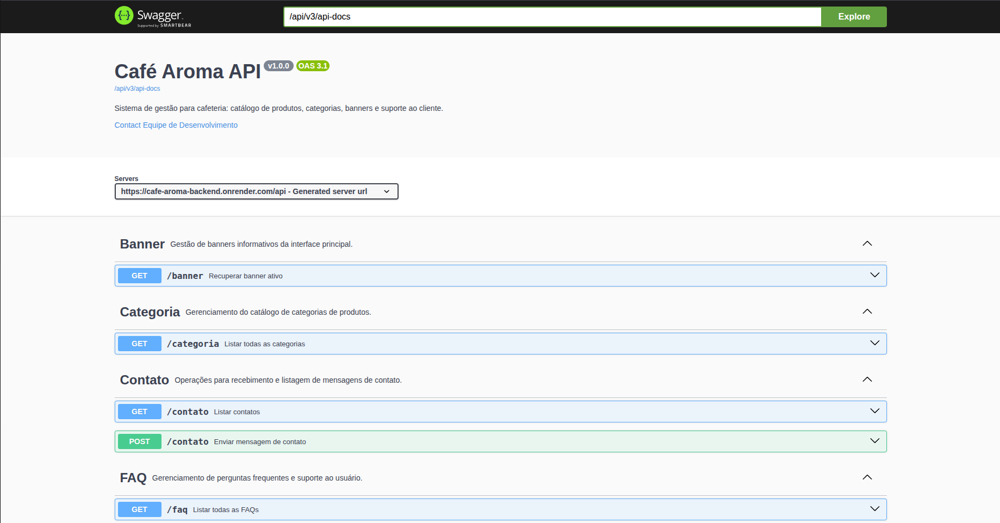

### Principais endpoints

| Método | Endpoint | Descrição |
|---|---|---|
| `GET` | `/banner` | Dados do hero da home |
| `GET` | `/sobre` | Seção Nossa História |
| `GET` | `/categoria` | Lista de categorias do cardápio |
| `GET` | `/produto/{categoriaId}` | Produtos por categoria |
| `GET` | `/faq` | Perguntas frequentes |
| `POST` | `/faq` | Cadastrar nova FAQ |
| `GET` | `/contato` | Listar contatos recebidos |
| `POST` | `/contato` | Enviar mensagem de contato |

---

### 📱 Frontend Web & Mobile

### Estrutura de pastas

```
frontend/src/
└── app/
    ├── components/
    │   ├── layout/
    │   │   ├── header/         # Header + menu hamburguer (compartilhado)
    │   │   └── footer/         # Footer (compartilhado)
    │   └── offline-screen/     # Tela de espera quando backend hiberna
    ├── interceptors/
    │   └── backend-status/     # Interceptor HTTP — detecta backend offline
    ├── interfaces/
    │   └── api.models.ts       # Interfaces TypeScript (Banner, Produto, etc.)
    ├── pages/
    │   ├── home/               # Página inicial
    │   ├── produtos/           # Cardápio por categorias
    │   ├── contato/            # Formulário de contato
    │   ├── faq/                # Perguntas frequentes
    │   └── admin/              # Painel administrativo
    ├── services/
    │   ├── api.ts              # Serviço HTTP centralizado
    │   └── backend-status.ts   # Sinal reativo de status do backend
    ├── app.component.ts        # Raiz da aplicação + ion-menu global
    ├── app.routes.ts           # Roteamento lazy load
    └── main.ts                 # Bootstrap com provideHttpClient
```

### Destaques técnicos

- **Paleta de cores centralizada** — variáveis CSS globais (`--cafe-wood`, `--cafe-gold`, `--cafe-beige`, `--cafe-dark-green`, `--cafe-snow`) definidas em `theme/variables.scss`
- **Interceptor de status** — `BackendStatusInterceptor` captura erros `status 0 / 503 / 504` e ativa a tela de espera global via `Signal` reativo
- **Tela offline** — exibe mensagem elegante e tenta reconectar automaticamente a cada 10 segundos, redirecionando para `/home` quando o backend responder
- **Componentes de layout compartilhados** — `app-header` e `app-footer` usados em todas as páginas
- **`ion-menu` no nível raiz** — posicionado no `app.component.html` para compatibilidade com Capacitor no Android
- **Lazy loading** — todas as páginas carregadas sob demanda via `loadComponent`
- **Responsivo** — breakpoints para web, tablet e Android (480px / 768px)

### Telas — Web

<div align="center">

  <p><strong>Home</strong></p>
  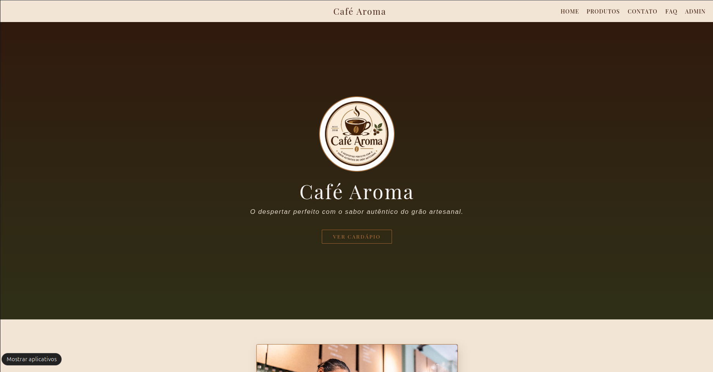

  <br/><br/>

  <p><strong>Produtos</strong></p>
  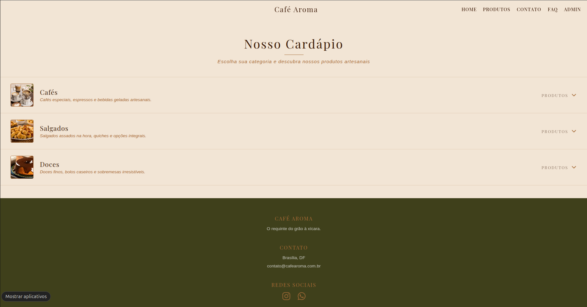

  <br/><br/>

  <p><strong>Contato</strong></p>
  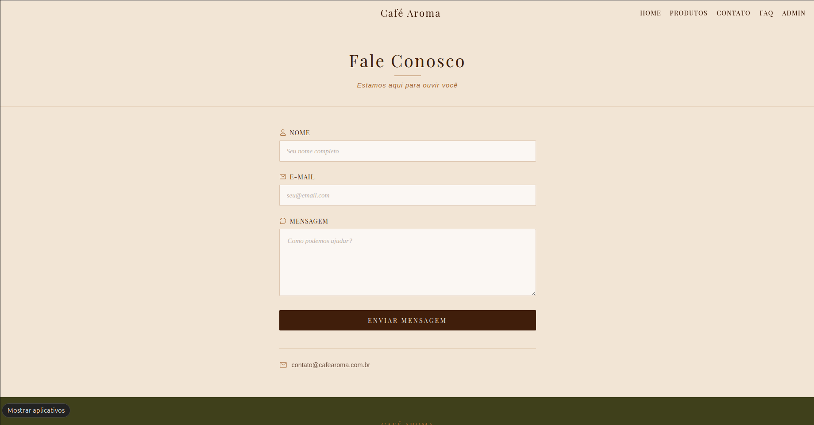

  <br/><br/>

  <p><strong>FAQ</strong></p>
  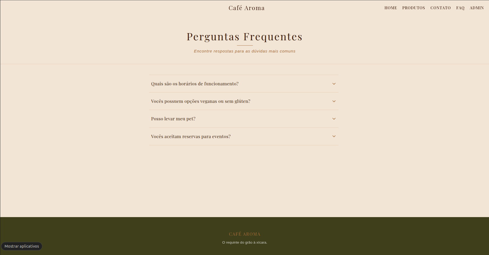

  <br/><br/>

  <p><strong>Admin</strong></p>
  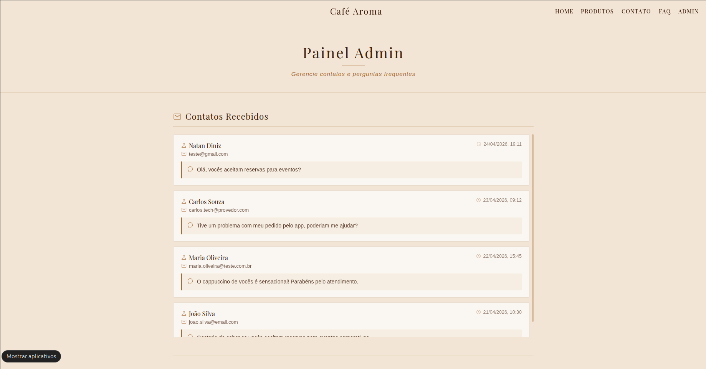

  <p><strong>Offline</strong></p>
  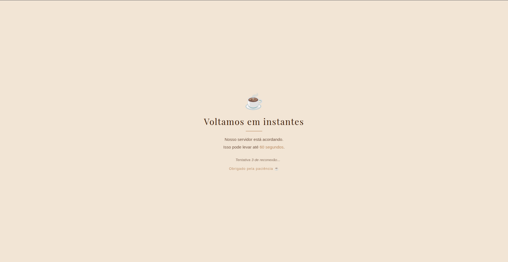

</div>

### Telas — Mobile (Android 16 Baklava)

<div align="center">
  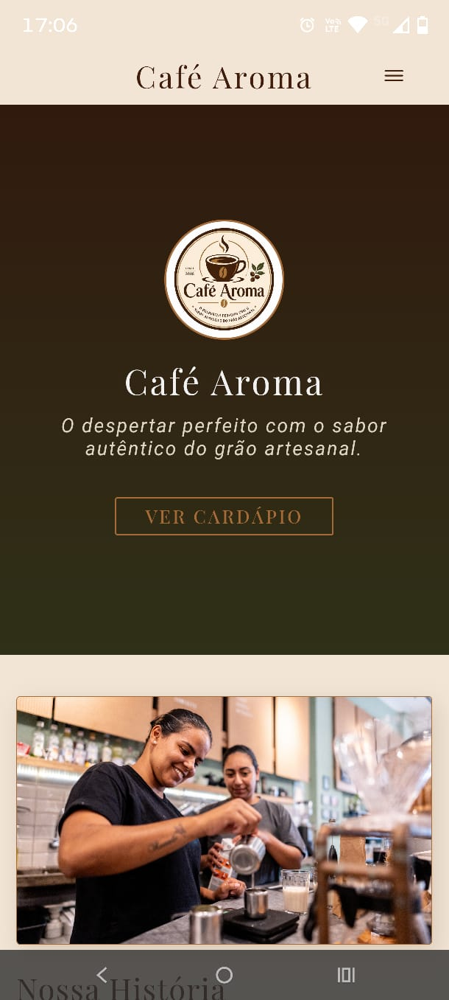
  &nbsp;&nbsp;
  
  &nbsp;&nbsp;
  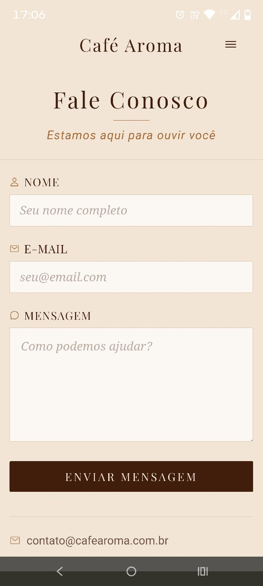
  &nbsp;&nbsp;
  
  &nbsp;&nbsp;
  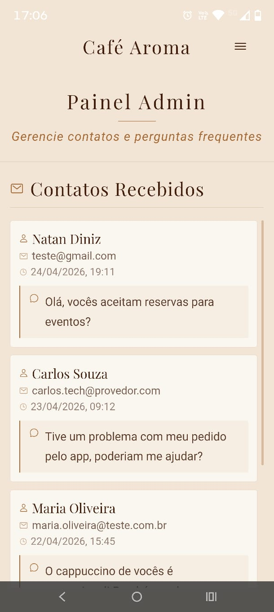
  &nbsp;&nbsp;
  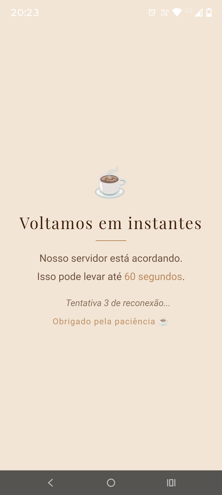
</div>

---

### 🚀 Deploy — Render

### Backend

Subido como **Web Service** no Render via **Dockerfile**:

```dockerfile
FROM maven:3.9.6-eclipse-temurin-21 AS build
WORKDIR /app

COPY pom.xml .
RUN mvn dependency:go-offline

COPY src ./src
RUN mvn clean package -DskipTests

FROM eclipse-temurin:21-jre-jammy
WORKDIR /app

COPY --from=build /app/target/*.jar app.jar
EXPOSE 8080
CMD ["java", "-jar", "app.jar"]
```

Disponível em:
```
https://cafe-aroma-backend.onrender.com/api
```

### Frontend Web

Subido como **Static Site** no Render com os comandos:

```bash
# Build command
npm install && ./node_modules/.bin/ng build --configuration production

# Publish directory
www
```

Disponível em:
```
https://cafe-aroma-ftdk.onrender.com/home
```

### Mobile

Buildado localmente via **Capacitor + Android Studio**:

```bash
ionic build
ionic cap sync android
ionic cap open android
# Build > Generate Signed APK no Android Studio
```

> ⚠️ **Hibernação do Render:** O plano gratuito do Render coloca os serviços em standby após 15 minutos de inatividade. A primeira requisição pode levar **até 60 segundos** para o backend iniciar. O frontend trata isso automaticamente com a tela de espera e retry automático.

---

### ▶️ Como executar localmente

### Backend

```bash
# Clone o repositório
git clone <url-do-repo>
cd backend

# Execute com Maven
./mvnw spring-boot:run

# A API estará disponível em:
# http://localhost:8080/api

# O Swagger estará em:
# http://localhost:8080/api/swagger-ui/index.html
```

### Frontend Web

```bash
cd frontend

# Instale as dependências
npm install

# Execute em modo desenvolvimento
ionic serve

# Acesse em:
# http://localhost:8100/home
```

### Mobile (Android)

```bash
cd frontend

# Gere o build
ionic build

# Sincronize com o Capacitor
ionic cap sync android

# Abra no Android Studio
ionic cap open android

# No Android Studio: Run > Run 'app'
```

> Certifique-se de ter o **Android Studio** instalado com o **SDK do Android 16 (API 36 — Baklava)**.

---

### ⚠️ Observações acadêmicas

Este projeto foi desenvolvido com fins **exclusivamente acadêmicos**. Por isso, algumas práticas de produção foram intencionalmente omitidas:

- Sem autenticação/autorização na área admin
- Banco de dados H2 em memória (sem persistência entre reinicializações)
- Sem HTTPS forçado no backend local
- Sem rate limiting nos endpoints

---

### 👨‍💻 Autor

Desenvolvido com ☕ por **Natan Diniz**

Curso: **Técnico em Informática para Internet — CPET**

Sistema operacional: **Ubuntu**

---

<div align="center">

*"O requinte do grão à xícara."*

**☕ Café Aroma — CPET 2025**

</div>